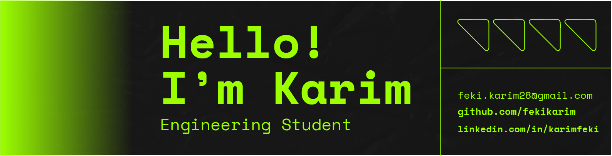

  

  
  
  

  
  
  
  
  

---

## 🎯 **About Me**

I am an **Engineering Student** with strong skills in **Full-Stack Development** including **Mobile, Web, and Desktop Application Development**. With a proven track record of delivering high-impact software solutions, I combine technical excellence with strategic thinking to create innovative applications that drive business success.

My professional journey encompasses **end-to-end software development**, from conceptualization and architecture design to deployment and maintenance. I excel in **cross-platform development**, **system optimization**, and **team leadership**, consistently delivering scalable solutions that exceed client expectations.

### **Current Focus Areas:**
- 🏗️ **Enterprise Software Architecture** - Designing scalable, maintainable systems
- 📱 **Cross-Platform Mobile Development** - Native iOS/Android and hybrid solutions  
- 🌐 **Full-Stack Web Applications** - Modern frameworks and cloud technologies
- 💼 **Technical Leadership** - Mentoring teams and driving engineering excellence

---

## 🛠️ **Technology Stack**

### **Programming Languages**

### **Frontend Technologies**

### **Backend & Frameworks**

### **Mobile Development**

### **Databases**

### **Tools & Technologies**

---

## 🚀 **Featured Projects**

### **🎮 The World Within**
**Award-Winning Game Development Project**
- 🏆 **2nd Place Winner** - Game Design & Development Day 2023
- 🎯 **Focus**: Cultural diversity through interactive gaming
- 👥 **Team**: KANM (Collaborative development)
- 🛠️ **Technologies**: Game Development Framework, 2D Graphics Engine

### **💼 HireUp - Recruitment Platform**
**Enterprise-Level Web Application**
- 🏆 **Top 3 Project** - Best Website Design & Development Day 2024 at ESPRIT
- 🎯 **Purpose**: Complete recruitment and employment solution
- 🛠️ **Tech Stack**: Full-stack web development with modern frameworks
- 📊 **Impact**: Streamlined hiring processes for multiple organizations

### **🛒 E-Commerce Platform**
**Full-Stack Commercial Application**
- 🏢 **Client**: Tunisie Telecom (2-month professional internship)
- 🛠️ **Technologies**: React.js, Backend APIs, Database Integration
- 📜 **Recognition**: Official internship certification
- 🎯 **Scope**: Complete e-commerce solution with payment integration

### 🧑‍💻 About Me:

- 🔭 Currently working on various **Mobile and Web Development** projects
- 🎮 Won **2nd place** for best video game at **Game Design & Development Day 2023** for developing the game *The World Within* with the team *KANM*
- 💼 Developed **HireUp**, a recruitment and employment website, which ranked in the **top 3 best projects** at the **Best Website Design & Development Day 2024** at ESPRIT
- 🌱 Completed a 2-month internship at **Tunisie Telecom**, where I built a **full-stack e-commerce website** using **React JS** and earned an "internship certificate"
- ⚡ Fun Fact: I’m passionate about coding and constantly looking for new challenges to solve!

---

### 👩‍💻 Collaboration:

I have collaborated with **@nesrine77** on various projects, including **KANM**, **FlyBox**, and **HireUp**. Our teamwork has allowed us to develop innovative solutions and enhance our skills through our internship experience at **Tunisie Telecom**.

---

### 🚀 Skills & Tools:

- **Languages**: Python, C, C++, JavaScript, Java, PHP
- **Frameworks**: Symfony 6.4, React, Node.js
- **Mobile Development**: Android, iOS
- **Web Technologies**: HTML5, CSS3, JavaScript, Bootstrap
- **Database**: MySQL, SQLite
- **Tools**: Git, Docker, Visual Studio Code, Figma
- **Design**: Graphic Design (Logos, Flyers), UI/UX Design

---

### 🎯 Current Focus:

- 📱 Deepening expertise in **Android and iOS development**
- 🌐 Enhancing **full-stack web development** skills
- 🏗️ Building innovative, real-world applications using **Symfony** and **React**
- 🧠 Learning about **business development** and entrepreneurship strategies

---

### 🏆 Achievements:

- **2nd Place** in the **Game Design & Development Day 2023** for developing the game *The World Within* with the team *KANM*
- Developed **HireUp**, a top 3 project at the **Best Website Design & Development Day 2024**
- Completed a **2-month internship** at **Tunisie Telecom**, building a **full-stack e-commerce website**
- Developed a 2D game called *The World Within* with a focus on cultural diversity
- Led and contributed to various team-based software projects with a focus on creating impactful, user-centered solutions

---

### 💼 Future Goals:

- 🚀 I aim to launch my own **business** that will blend cutting-edge technology with practical solutions to solve real-world problems
- 💡 Open to collaborating on exciting **software development projects** and exploring **startup** opportunities
- 🏆 Aspiring to continue growing as a **developer** and eventually expand into **business leadership**

---

## 🏆 **Professional Achievements**

<table align="center">
<tr>
<td align="center" width="50%">

### **🥈 Competition Excellence**
- **2nd Place** - Game Design & Development Day 2023
- **Top 3** - Best Website Design & Development Day 2024
- **Award-winning** game development with team KANM

</td>
<td align="center" width="50%">

### **💼 Professional Experience**
- **2-Month Internship** at Tunisie Telecom
- **Full-Stack E-Commerce** development certification
- **Cross-platform** mobile and web solutions delivery

</td>
</tr>
<tr>
<td align="center" width="50%">

### **👥 Leadership & Collaboration**
- **Team Leadership** in multiple successful projects
- **Collaborative Development** with @nesrine77
- **Mentoring** junior developers and students

</td>
<td align="center" width="50%">

### **🎨 Design Excellence**
- **UI/UX Design** expertise
- **Graphic Design** for branding and marketing
- **User-Centered** design methodology

</td>
</tr>
</table>

---

## 📊 **GitHub Analytics**

  
  
  
  

  
  
  

---

## 🎯 **Strategic Objectives**

| **Near Term (2025)** | **Medium Term (2026-2027)** | **Long Term (2028+)** |
|:---:|:---:|:---:|
| 🚀 **Launch Tech Startup** | 🏢 **Scale Business Operations** | 🌍 **Global Technology Impact** |
| 📱 **Advanced Mobile Solutions** | 💼 **Team Leadership Expansion** | 🎓 **Industry Thought Leadership** |
| 🌐 **Enterprise Web Platforms** | 🤝 **Strategic Partnerships** | 📈 **Sustainable Innovation** |

---

## 🤝 **Professional Network**

  
  
  
  
  
  

  
  
  
  

---

  
  ### **"Innovation distinguishes between a leader and a follower."**
  *— Steve Jobs*
  
  **Let's build the future together. Connect with me for collaboration opportunities.**
  

  
  
  

